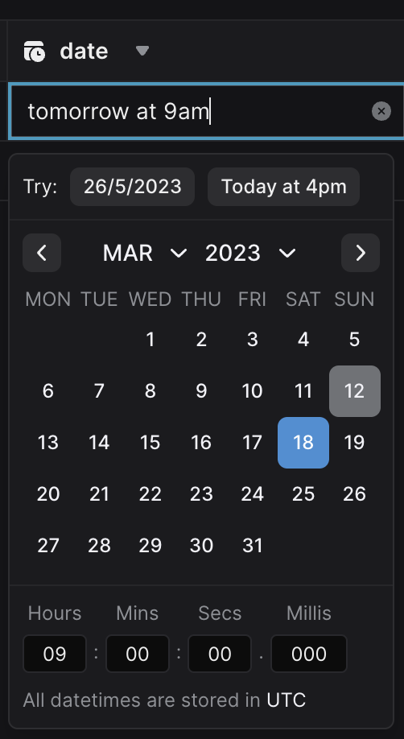

#### API

- Added atomic numeric operations to the update API. They work on the integer and float data types. They can be used, for example, to increment a counter without the risk of race conditions. [Docs are in](https://xata.io/docs/typescript-client/update#numeric-operations)

#### UI

- New date picker. A new custom-made date picker is used across the UI, solving a set of problems that we had with our previous solution. Among other things, the new date picker supports human input (e.g. “today at 4pm”) and has milliseconds support. The UI is also standardized to always use UTC, for better clarity on what is being stored in the database.

