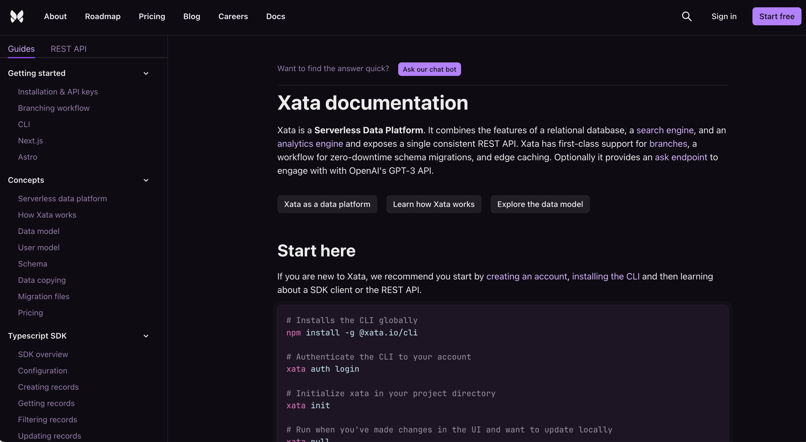
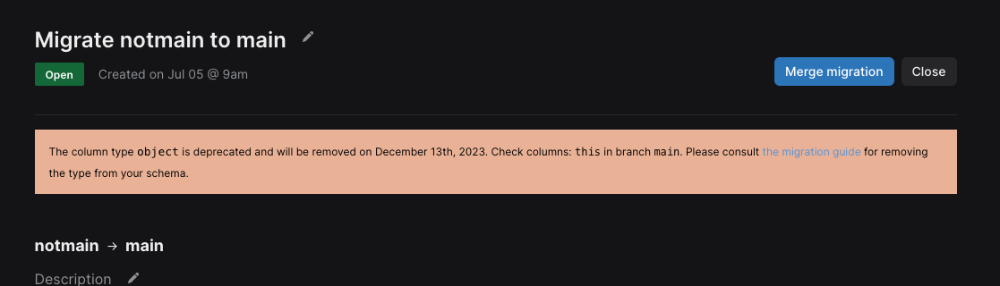

- Our docs just got a major face lift, matching the rest of our branding. Other improvements include:
    - The documentation content is now [public on GitHub](https://github.com/xataio/mdx-docs) and open for community edits.
    - Website search was rebuilt and will now output results from the blog alongside documentation.
    - Grammar and syntax highlighting in code snippets are improved.

- We’ve officially published the first preview versions of the `1.x` version of our Python SDK: https://pypi.org/project/xata/1.0.0a3/
- The early access program for image transformations and file storage has officially kicked off. Come join [our Discord channel](http://xata.io/discord) and hop into #eap-files if you’d like to join in on the fun.
- Community contribution from [cartogram](https://github.com/cartogram) to fix some typos in `xata init`
- The search API now includes the total hits returned in the search response ([canny request](https://xata.canny.io/feature-requests/p/include-total-hits-in-search-response)). This is only available in the REST API at the moment and SDK support will be coming soon.
- The `ask` endpoint that enables you to easily build ChatGPT experiences on your data is now conversational. With the latest update, you can now [ask follow up questions](https://xata.io/docs/api-reference/db/db_branch_name/tables/table_name/ask/session_id#ask-follow-up-questions-of-your-data) to your data.
- When deleting a workspace, delete based on the name of the workspace instead of the workspace ID.

<ArticleVideo 
    platform="html" 
    src="https://github.com/xataio/mdx-changelog/raw/main/images/2023-07-18-02-delete.mov" 
/>

- Display an object deprecation notice where appropriate throughout the Xata app

- Adds the physical close button back in for mobile record / image viewing as a more obvious close option
- Resolved numerous bugs in the table related to linked columns and metadata fields

New blog posts:

- [Connecting data sources to Xata with Airbyte and Zapier integrations](https://xata.io/blog/connecting-data-sources-xata-airbyte-zapier-integrations)
- [Create an advanced search engine with PostgreSQL](https://xata.io/blog/postgres-full-text-search-engine) (#1 on Hacker News 🎉)