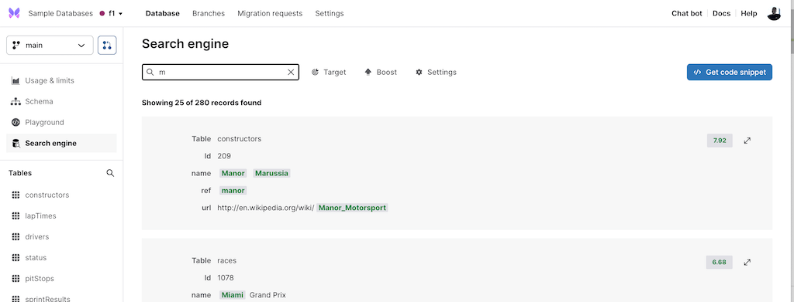

- CSV Import CLI improvements: CSV Import via the CLI is now ~2.5x faster and infers column types better. We're also updating our CSV import UI - watch this space for updates.
- As announced in the previous edition of the Changelog, the search API now returns the total number of hits. The TypeScript SDK now supports retrieving this total count and it is also displayed in the Xata UI.

- The TypeScript SDK now supports [sessions for the Ask endpoint](https://xata.io/docs/typescript-client/ask#asking-follow-up-questions). This means it's now possible to ask follow-up questions when using ChatGPT to get answers from your database.
- Usability improvement: When adding a new table or a new column, invalid characters are blocked at the input level, saving you time.
- Fixed horizontal scrolling and improved the word warping in the Playground.
- Fixed showing of leading zeros in numeric cells in the table.

## Blog posts:

- [Full-text search engine with PostgreSQL: Postgres vs Elasticsearch](https://xata.io/blog/postgres-full-text-search-postgres-vs-elasticsearch)
- [Navigating the database landscape: overview of SQL, MySQL, PostgreSQL, and NoSQL](https://xata.io/blog/sql-mysql-postgresql-nosql)
