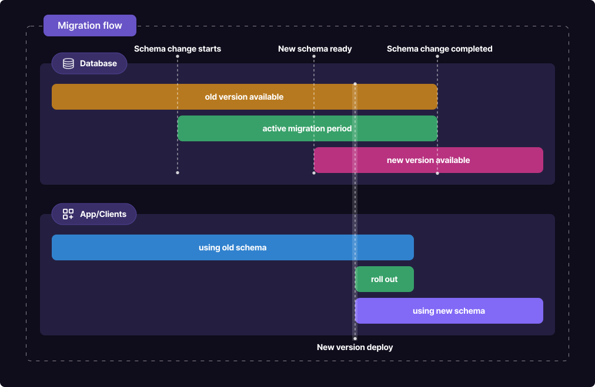

## What’s new?

Discover the latest enhancements and feature updates at Xata:

- **Case insensitive matching is now available:**  Users can now benefit from case-insensitive matching. This functionality is perfect for those dealing with mixed-case data entries or aiming for a broader text search result regardless of character case.  Learn more about this feature in our [SDK filtering docs](https://xata.io/docs/sdk/filtering#case-insensitive-matching).
- **Enhanced security with OAuth 2.0 support:** We're excited to announce that we've expanded and improved our OAuth 2.0 support, the industry-standard protocol for authorization. This enhancement aims to offer more flexibility and security to our users while integrating third-party applications - you can expect more straightforward implementations, and enjoy more robust security measures. See our [integration docs](https://xata.io/docs/integrations/oauth) for more information.
- **Enriched** **SQL proxy logs:** SQL proxy logs have been improved to offer enhanced clarity. The `stmt_type` now signifies the distinct SQL operation, such as select, insert, update, or delete. The `record_count` captures the number of processed and returned rows, while in insert and update actions, `res_target_count` enumerates the total values used.
- **Increased pagination capacity:**  To better accommodate users' data retrieval needs, we've enhanced to the pagination feature. Originally set to handle 10,000 records, the platform's pagination limit has now been expanded to support up to 50,000 records. See our [docs][(https://xata.io/docs/sdk/get#offset-based-pagination) for more information.
- **Introducing the beta version of `pgroll`:** `pgroll` is a dedicated open-source command-line tool tailored for streamlined schema migrations on Postgres databases. Designed to minimize downtime and offer instant rollbacks, it's now available for experimentation and feedback in our GitHub repository. Check out our [blog](https://xata.io/blog/pgroll-schema-migrations-postgres) to learn more.
    
- **Improved transactions helper in the Python SDK:** - In response to valuable user feedback, we've implemented changes in the transaction helper. Now, it will smoothly back off and retry on rate-limiting errors, without evicting all operations on errors. Additionally, we've added the capability to specify the target branch in the execution call [xata-py#173](https://github.com/xataio/xata-py/pull/173).
- **New version of the TypeScript SDK available:** We have released an updated version of the TypeScript SDK. This release brings improvements and optimizations to better cater to the needs of TypeScript developers using our platform.
- **Percentiles aggregation added:** Similar to Elasticsearch, we have implemented a percentiles aggregation feature. This update includes schema modifications for average and percentiles aggregations, as well as adjustments to the handling of values, ensuring compatibility with both string and number types. See our [docs](https://xata.io/docs/sdk/aggregate#percentiles) for more information.
- **Support for conflict support  in `INSERT` Statements :** To offer better conflict management in data operations, we've enhanced the SQL proxy. Users can now leverage the **`ON CONFLICT`** clauses when using **`INSERT`** statements. This means when attempting to insert data that might cause a conflict, like a duplicate key, you now have more control over the response - you can ignore the conflict or update the conflicting record.
- **Updated Zapier Integration:** The latest version of our Zapier integration, v1.0.1, now provides support for JSON columns. This enhancement facilitates more versatile data handling and interaction for users leveraging JSON structured data within their Zaps.

## Blog posts

Explore Xata's recent blog posts to stay informed. Subscribe to the [blog](https://xata.io/blog) to get the latest content delivered to your inbox. Here are some of our recently published posts:

- [Xata Playground now runs Python in the browser](https://xata.io/blog/playground-python)](https://xata.io/blog/playground-python)
- [Introducing pgroll: zero-downtime, undoable, schema migrations for Postgres](https://xata.io/blog/pgroll-schema-migrations-postgres)
