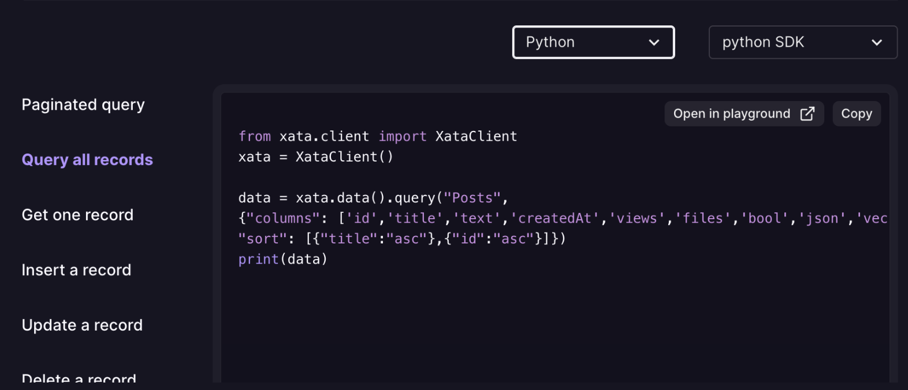

## What’s new?

Discover the latest enhancements and feature updates at Xata:

- **Added blog navigation by tags:** We've introduced a new feature that simplifies blog exploration. Now, you can easily discover blog posts by appending tags such as "postgres," "engineering," "product," "community," and more to the end of the blog tags URL (`https://xata.io/blog/tags`). This enables you to find and browse blog posts relevant to your specific areas of interest. For example, you can access all Xata blog posts related to PostgreSQL using the following URL: `https://xata.io/blog/tags/postgres`, or filter by two tags using a URL like this: `https://xata.io/blog/tags/community,announcements`. In addition, tags will soon be accessible directly through the UI for even easier navigation.
- **Enhanced CSV file import support:** This update introduces the capability to import both remote and local CSV files, where only the file's path or URL is needed in the CSV file. While this feature is currently available in the TypeScript client, it is set to be expanded to the UI and CLI.
- **Enhanced search responses:** This update introduces the `totalCount` field in search responses (including `search`, `search.byTable`, `search.all`, and `vectorSearch`) to report the total number of matching records. This change modifies the response format from an array to an object. The addition of this field provides more information about the search results, allowing users to understand the extent of data matching their search criteria.
- **Improved Python syntax and error messages:** The playground now offers better syntax highlighting and a more intuitive display of errors for Python code.
- **Intiating branch movement between cells:** Work has begun on a feature to move branches between cells, facilitating the transfer of databases and data to dedicated clusters. 
- **Migration to monorepo:** Our site has successfully migrated to a monorepo structure. This means that related Xata projects, components, and resources are now stored in a single repository for improved code management and collaboration. This update lays the foundation for a more personalized and immersive user experience across our app, website, and documentation.
- **Python code snippets and improved connector information:** We’ve added Python code snippets within the playground. Users can now easily integrate and experiment with Python for an improved development experience. Additionally, we've enhanced the connector info for Drizzle and Kysely snippets across local repositories, covering all data types for a better user experience.
    
- **Support for importing vector columns:** With this enhancement, you can now import and work with vector columns in your data.
- **Tracking usage metrics:** Progress has been made in gathering usage metrics, including Postgres disk usage and `ask` endpoint usage, which are now being sent to Clickhouse.

### Latest developments in pgroll  

Take a look at the recent progress in our [pgroll](https://github.com/xataio/pgroll) project:

- **[_NEW_]** **Security definer added:** With the addition of the `SECURITY DEFINER` attribute, the security model of the pgroll schema allows admins to restrict access while ensuring uninterrupted functionality [#191](https://github.com/xataio/pgroll/pull/191). Thank you @jankatins for your contribution.  
- **[_FIX_]** **Fixed `previous_version` function:** Resolved an issue where the `previous_version` function did not correctly remove the previous version schema upon completing migrations applied in schemas other than public and enhanced testing to ensure that the `--schema flag` is properly respected [#190](https://github.com/xataio/pgroll/pull/190)

## Blog posts

Explore Xata's recent blog posts to stay informed. Subscribe to the [blog](https://xata.io/blog) to get the latest content delivered to your inbox. Here is our most recently published blog post:

- [Database nightmares: Tales from the Postgres crypt](https://xata.io/blog/database-horrors)
- [Distilling news articles and legal research into simple chat experiences](https://xata.io/blog/community-spotlight-chat-search-experiences)