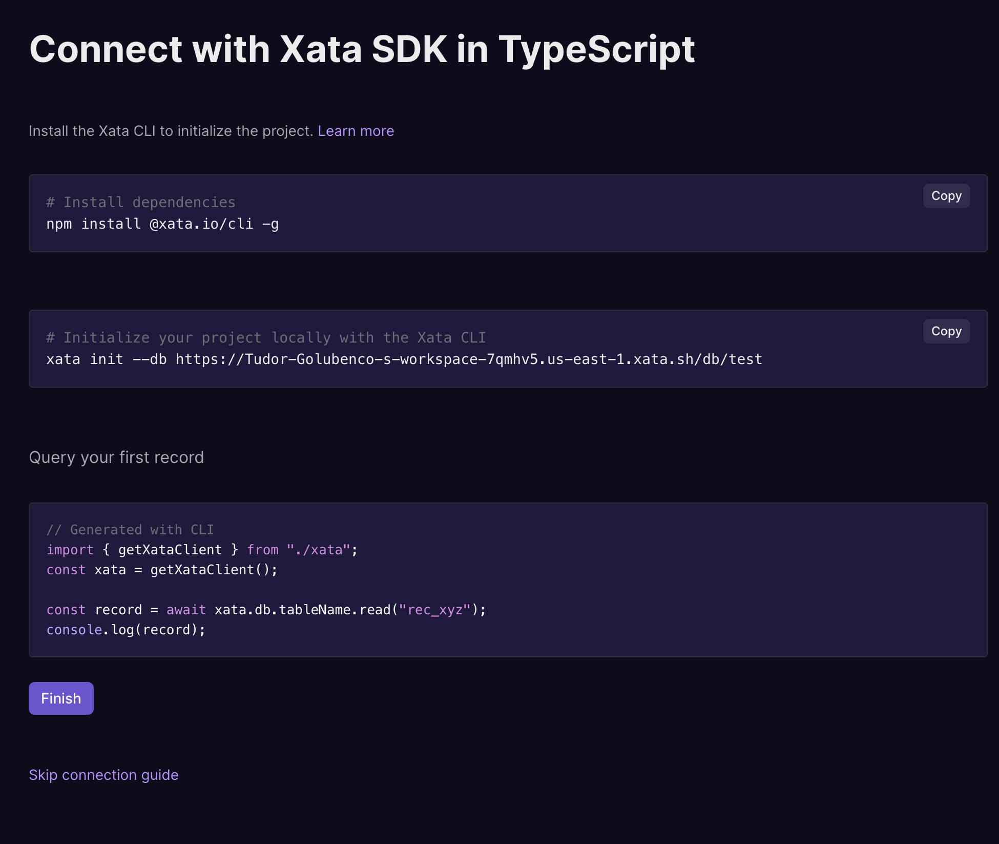

### What's new

- File uploads from the browser! This was a highly requested feature for file attachments. The way it works is that you can create a new record without passing the file, you get back an `uploadUrl` that is safe to pass to the browser, then you upload the file to that URL. For more details, see the documentation for [Upload URLs](https://xata.io/docs/concepts/file-attachments#upload-urls). This [example](https://github.com/xataio/examples/tree/main/apps/sample-nextjs-upload-file) demonstrate doing files uploads directly from the browser, in a sample Next.js application.
- We've shipped a new onboarding workflow for creating and connecting to databases. The new workflow asks a few questions and then displays instructions that fit with your particular case.

  

- Cloudflare launched a database integration for Xata. Please see the docs [here](https://developers.cloudflare.com/workers/databases/native-integrations/xata/), and there's also a demo on Cloudflare TV.
- Lots of tables? You're going to enjoy this quality of life improvement where you get a search box on top of the list of tables.

<ArticleVideo 
    platform="html" 
    src="https://us-east-1.storage.xata.sh/ma7stcfqbd7dh285mvnrll36v8" 
    width="1042"
    height="696"
/>

- The branch selector in the UI now accepts hundreds or thousands of branches, for our dear heavy-branch users.
- The workspace invite emails got a facelift with our updated branding.
- Made it possible to query Xata metadata columns when using the Drizzle integration.
- Fixes for using transaction via the TypeScript SDK.
- Added a “Back to Workspace” button when you are on Account settings. Makes it easier to well, get back to the workspace.
- Fixed indexing in the search engine for the JSON type values.
- Fixed replication errors in some corner cases.
- Fixed the support for some SQL queries that are using sub-queries.
- Fixed a couple of typos in the OpenAPI spec, because attention to details matters.

### Workshop

- The first Xata workshop: [Learn how to perform Postgres schema changes in production with zero downtime](https://event.webinarjam.com/register/4/6ykxlh9). It's this Wednesday, register for free to get the recording.

### Blog posts

- Xata-Cloudflare integration: [Connect your Cloudflare Worker with Xata in one click](https://xata.io/blog/cloudflare-integration)
- The Club Xata experience - [connecting, collaborating, creating](https://xata.io/blog/offsite-tenerife-2023)
- Tutorial: [Build your own image gallery CMS](https://xata.io/blog/build-image-gallery-astro-cloudflare)
- Community spotlight: [Automating the creation of Shopify stores with Xata](https://xata.io/blog/community-spotlight-automate-shopify-store-creation)
- Community spotlight: [Reducing search response time by 99.98% with Xata](https://xata.io/blog/community-spotlight-reducing-search-time)
