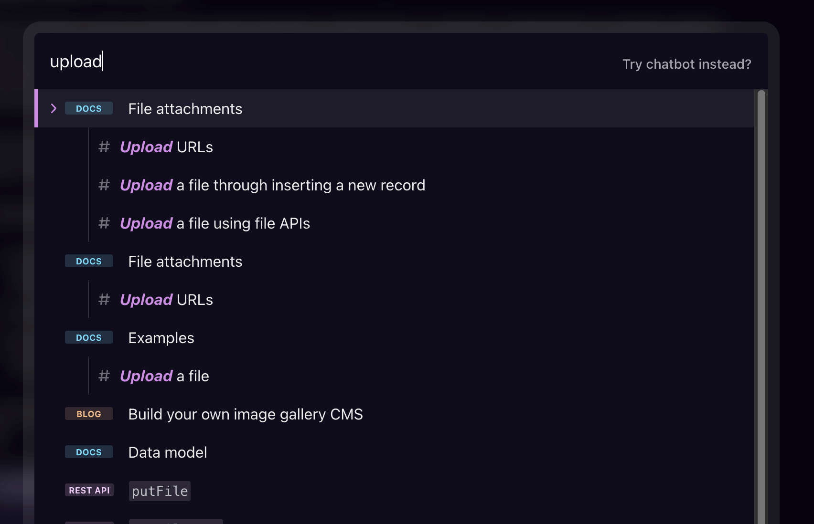
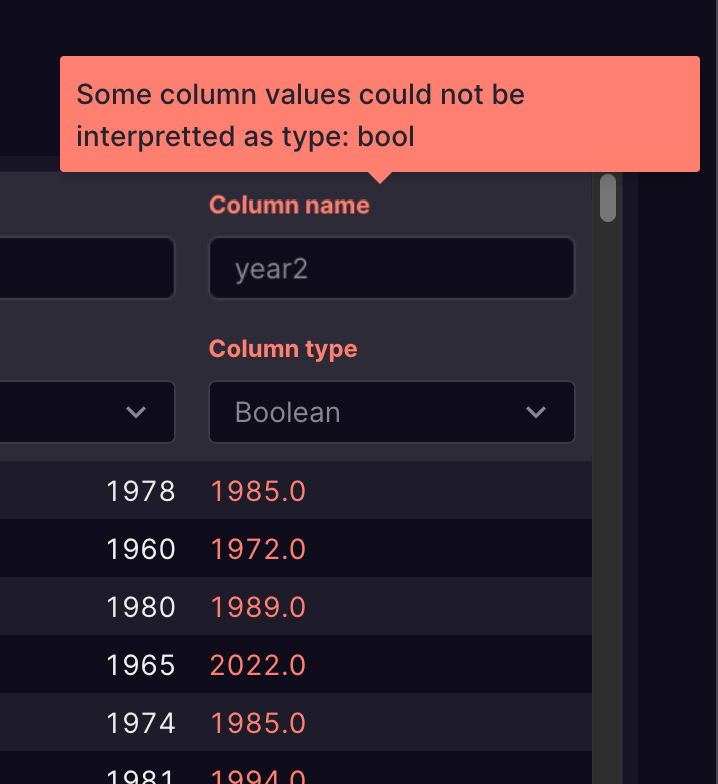

### What's new

- We improved the website search experience, which itself uses Xata's full-text search features. Search results now additionally match against headers within documents, which should make functions and other deeper content easier to find. Please let us know if you have any feedback or if particular search terms don't seem to work as expected.

  

- Speaking of search, we have also improved the docs for our search functionality: https://xata.io/docs/sdk/search
- Improved CSV import error reporting in the UI by showing tooltips above the column names that have errors.

  

- Small fix to the focus state of the Github connect button on the database cards. Previously the opacity wasn't being switched.
- Fixed default TTL for the signed URLs created for file attachments when updated via partial update.
- Fixed some broken links in the OpenAPI spec documentation.
- For another public website improvement, you can now subscribe to RSS feeds for particular categories of our blog.
- A new example for [uploading files using Next.js](https://github.com/xataio/examples/tree/main/apps/sample-nextjs-upload-file) was added to our examples repository.

### Blog posts

- [How to perform Postgres schema changes in production with zero downtime](https://xata.io/blog/zero-downtime-schema-migrations-postgresql) - This contains a recording and summary of the workshop we did about schema changes in Postgres with zero downtime. If you missed the workshop, you can still watch the recording!
- [Announcing the winners of the Holiday Hackathon](https://xata.io/blog/holiday-hackathon-challenge-winners) - Congrats to all winners! 🎉🎉🎉