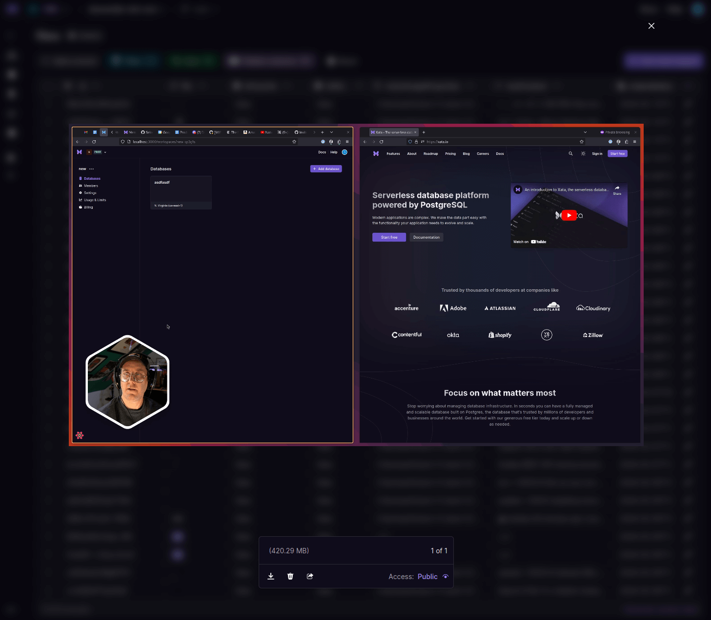

### What's new

- Video and audio files previews in the UI: If you use file attachments and attach video or audio files, you now get a nice player in the UI to preview the file.

  

- Initiate filters from the column headers! This is a small change, but it's a really nice shortcut.
- Another quality of life improvement: when adding a new record, the default values are now pre-filled in the form. This should save you a few clicks and make the process smoother.

<ArticleVideo
  platform="html"
  src="https://us-east-1.storage.xata.sh/labrlg4kc97fndpb6ks39uo2m8"
  width="1280"
  height="720"
/>

- File attachment URLs are now returned automatically in the search results. While previously you had to query the transaction store (/query), you can now get the file attachment URLs directly from the search results. This will save some round-trips.
- Improved the table search code snippets in all languages for which we have SDKs.
- When uploading a file, the upload response now contains all the object fields, with the exception of the actual file content.
- Fixed a bug where CSV download was occasionally failing.
- Fixed a bug where in the link selection dialog the column selector was not a drop-down.

### Blog posts

- [Create your own content management system with Remix and Xata](https://xata.io/blog/content-management-system-remix-xata) by Rishi Raj Jain - This tutorial shows you how to build a content management system with Remix and Xata.
- [Educating new frontend developers with Xata](https://xata.io/blog/community-spotlight-educating-frontend-developers) - A community spotlight putting the spotlight on Teri Eyenike, a software engineer out of Lagos, Nigeria empowering the next generation of developers to build.
