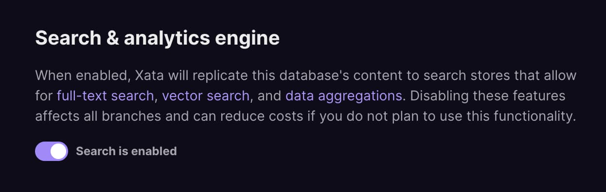
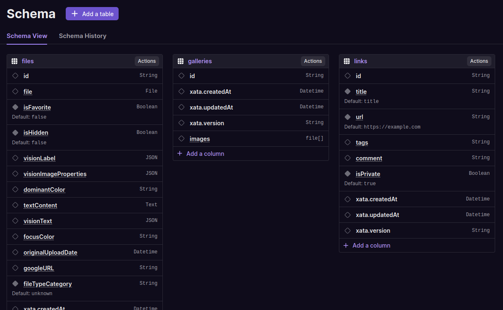

### What's new

- We have added a way to disable search on your database. This is a good way to reduce cost if you aren't using any of the search functionality (search, aggregation, vector search). By disabling search, you won't be paying for Elasticsearch storage. You can find the toggle in the database settings. Don't worry though, search is still included in the free tier and enabled by default.

  

- The schema edit view within the UI received a visual upgrade. It should be easier to view the requirements for each column at a glance.

- In preparation for our upcoming releases, we have re-structured our docs to make it easier to find what you're looking for. Please let us know if you have any feedback! Also quick reminder: the search bar in the docs works really well (because it's based on Xata).
- We've added `beta` and `alpha` tags to features that are not yet generally available. At a high level you can think of `alpha` as "only available to a select group of users" and `beta` as "available to all users, but not yet stable".
- Updated the error messages when trying to use the SDK directly from the browser to point to a particular docs URL.
