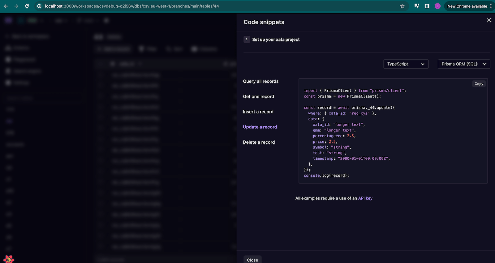

### What's new

- Added Prisma ORM sample code snippets to the drawer, automatically matching your project and the current view in the table.

  

- SQL-compatibility improvements over the wire protocol:
  - Allowed more SQL functions to be executed over the wire protocol, including `get_random_uuid`, `pg_try_advisory_lock`, `pg_describe_object`, and `pg_stat_get_numscans`.
  - Added support for `CREATE SEQUENCE` and sequence functions.
  - Added support for creating views.
  - Added support for `INSERT FROM SELECT` statements.
  - Added support for `CREATE TYPE`.
  - Better support for identity columns.
- UI: Left side nav is now sticky on long pages.
- UI: Improvements for the mobile navigation.
- Usage monitoring: Fix storage metric collection for columns of type File that were using mixed case.
- Dedicated clusters Early Access Program: various fixes.
- Website: Added the ability to filter blog posts by authors and tags. For example see this [filtered query](/blog?author=Alexis%20Rico&tags=serverless,ai).