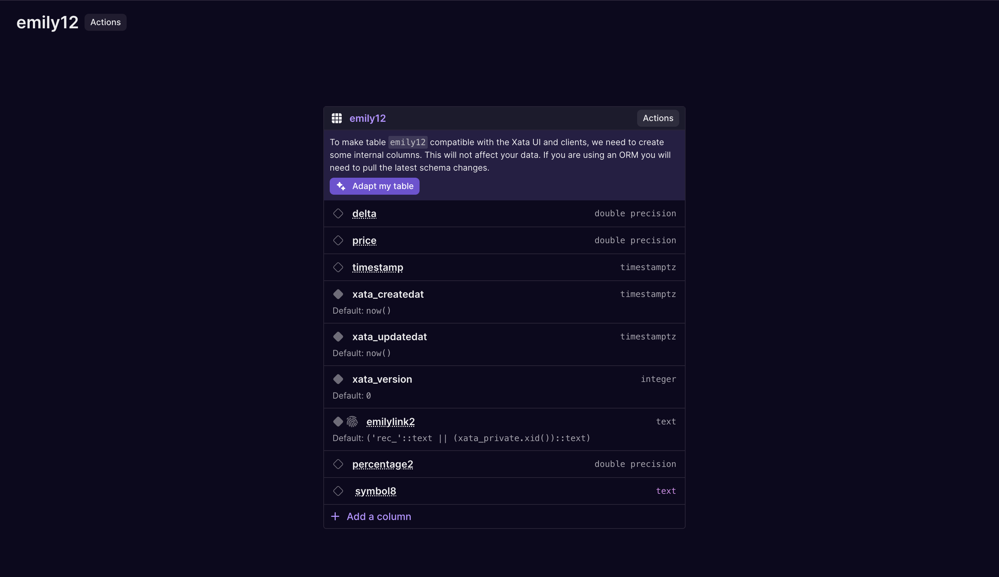

### What's new

- We have continued to improve the SQL compatibility with Postgres for our shared clusters:
  - Allow sub-queries in INSERT/UPDATE statement
  - Allow `server_version_num` setting
  - Allow `SET CONSTRAINTS` command
- Improved the message ORM users see after adapting a table schema. Because "adapt" adds a few columns, it is important to pull/introspect the schema after making changes to the table.

  

- File Attachments: Return all file object properties in upload response. This can simplify your code when using upload URLs.
- If you don't specify a branch name in the Postgres wire connection string, we will default to the `main` branch.
- Fix: Close Postgres wire connection when a database branch is deleted.
- Fix: Improve retry logic for outdated query plans errors.
- Improved error handling: if we get a 400 from Elasticsearch, we will now return a 400 to the client.
